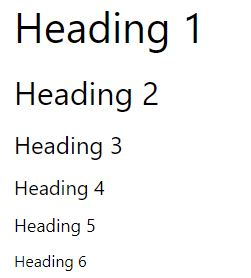

# Page Structure & Layout

HTML is the most basic building block of the web.  
It provides the basic structure of a page's layout - text, media, ads, navigation, etc. 

<br>

**Page Structure:**

An HTML file is comprised of two basic components: 
* the Head
* the Body 

A footer is sometimes added on after the main body, but this is optional. 

<br>

**Basic HTML File Boilerplate:**
```html

<!DOCTYPE html>                                   // Declaring that the HTML Document uses HTML5
<html lang="en">                                  // Declaring the HTML language helps the browser render it appropriately
  <head>
    <meta charset="UTF-8">                        // Declare the character set
    <title>HTML 5 Boilerplate Starter</title>     // Title of the page goes in the head
  </head>
  <body>
           // The actual page content of the web page goes in the body
  </body>
</html>
```
<br>

## Head 


<br>

## Body
The Body of an HTML file is the content that appears to someone viewing that page in a web browser

### Body Elements

#### div

#### span
The ```<span>``` element is an HTML element that allows you to drop a CSS class or id hook wherever you need with no unwanted side effects.

More about this in CSS Notes. 

<br>

### Headings
Headings in HTML help to organize information into categories and sub-categories of increasing complexity and information. 

```<h1>``` is the most important, and ```<h6>``` is the least important.

It is important to use headings correctly in web development, as screen readers rely on the correct use of headings to accurately parse pages for sight-impaired people.   
If a heading is too large, use CSS to resize it over using a less important heading. 

```html
<h1>Heading 1</h1>
<h2>Heading 2</h2>
<h3>Heading 3</h3>
<h4>Heading 4</h4>
<h5>Heading 5</h5>
<h6>Heading 6</h6>
```


<br>


###
