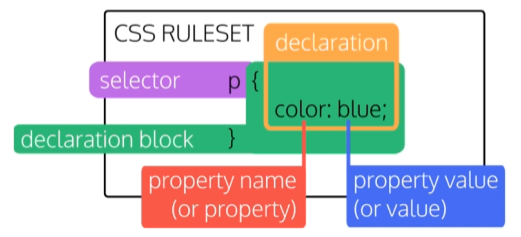

# Basic CSS Notes

CSS is Cascading Style Sheets.  
The "cascading" algorithm determines how CSS is applied to a web page.

CSS determines the width, height, colors, margins, borders, backgrounds, etc. of web pages. 

<br>

## External and Internal Stylesheets
CSS may be applied to a web page using two methods: 
* External Stylesheets
* Internal Stylesheets

### External Stylesheets
External stylesheets are CSS documents that exist on their own, independent from any other code or HTML.  
**External stylesheets are the preferred way to utilize CSS**     
They are easier to maintain and have the advantage of being modular.  
External stylesheets can also be linked to multiple HTML pages.
```css
stylesheet.css
```
External stylesheets are linked in HTML with ```link rel```:
```html
<link rel="stylesheet" href="CSS/Style.css">
```


### Internal Stylesheets
Internal stylesheets are placed in the ```<head>``` of an HTML document using ```<style>``` tags.
```html
<!DOCTYPE html>
<html lang="en">
  <head>
    <meta charset="UTF-8">

    <style>
        body{
            background-color:#333333;
        }
    </style>

    <title>Some Web Page</title>
  </head>
```


### Inline Styles -- NO!
CSS styling *can* be applied directly to HTML elements... but please don't. **Please don't do this.**  
This example is presented solely because it's still semi-common to run into inline styling in the wild while looking at sites with dev tools, and it helps to know what you're looking at. 

Inline CSS Styling is the equivalent of a kid writing with crayon on the wall:  
You may have made it work, but no one is happy & now your mess needs cleaned up. 

**Do Not Do This:**
```html
<body>
    <--! Please Don't Do This -->
    <section style="background-color:#333333;">     // NO!!
    <--! God No -->
    </section>
</body>
```


<br>

## CSS Styling and Rules
### Basic CSS Declaration


<br>

### CSS Selectors
Every CSS rule starts with a selector, seen above in pink.

Common selectors include:
* element (type) selectors
* id selectors
* class selectors


#### An element css selector referencing the HTML element type

``` css
    h2 {
       font-family:monospace;
   }
```

#### A class css selector referencing the HTML class
```class``` selectors may be applied to multiple HTML elements.  
Multiple ```class``` selectors may be applied to a single element.
A ```class```

``` css 
    .redclass {
       color:red;
   }
```

#### An id css selector referencing the HTML id
```id``` selectors should be unique and only applied to one HTML element.  
If ```id``` is used multiple times, only the first element with that ```id``` will be targeted

Multiple ```id```s cannot be set on the same element

```css
    #bigdiv {
        background-color:red;
   }
```

Example:

```html
    <div id="bigDiv">
        <h2>Hello World</h2> 
        <h3 class="redclass">Red Red Red</h3>
    </div>
```


```css
h2 {
    font-size: 18px;
}

#bigDiv {
    display: inline;
}

.redclass {
    color: blue;
}
```
<br>

### HTML Span Element
The ```<span>``` element is an HTML element that allows you to drop a CSS class or id hook wherever you need with no unwanted side effects.  

```html
<head>
    <style>
        .red{
            color:red;
        }
    </style>
</head>
<body>
    <p>I wish this <span class="red">text was red</span></p>
</body>
```

<br>

### Pixels vs. Em vs. Rem

```css
/* Pixels are not fixed across resolutions */
body{
    font-size:16px;
}


/* But em and rem are */
body{
    font-size:2em;
}

body{
    font-size:3rem;
}
```

Pixels do not render at the same size across different monitors:  
100px is going to look different at 1024px x 768px than it does at 2560px x 1440px.

Because of this, it is better to use ```em``` and ```rem``` than it is to use ```px```

#### Em
```em``` is relative to the font size of its direct or nearest parent.  
Because of this, ```em```'s size may fluctuate based on where in the page it is used.


#### Rem
```rem``` is relative to the root HTML document font size, so using ```rem``` will always scale to the same size across HTML elements


<br>

