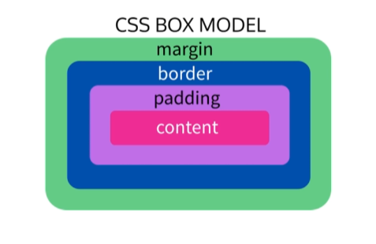

# Basic CSS Notes

CSS is Cascading Style Sheets.  
The "cascading" algorithm determines how CSS is applied to a web page.

CSS determines the width, height, colors, margins, borders, backgrounds, etc. of web pages. 

<br>

## External and Internal Stylesheets
CSS may be applied to a web page using two methods: 
* External Stylesheets
* Internal Stylesheets

### External Stylesheets
External stylesheets are CSS documents that exist on their own, independent from any other code or HTML.  
**External stylesheets are the preferred way to utilize CSS**     
They are easier to maintain and have the advantage of being modular.  
External stylesheets can also be linked to multiple HTML pages.
```css
stylesheet.css
```
External stylesheets are linked in HTML with ```link rel```:
```html
<link rel="stylesheet" href="CSS/Style.css">
```


### Internal Stylesheets
Internal stylesheets are placed in the ```<head>``` of an HTML document using ```<style>``` tags.
```html
<!DOCTYPE html>
<html lang="en">
  <head>
    <meta charset="UTF-8">

    <style>
        body{
            background-color:#333333;
        }
    </style>

    <title>Some Web Page</title>
  </head>
```


### Inline Styles -- NO!
CSS styling *can* be applied directly to HTML elements... but please don't. **Please don't do this.**  
This example is presented solely because it's still semi-common to run into inline styling in the wild while looking at sites with dev tools, and it helps to know what you're looking at. 

Inline CSS Styling is the equivalent of a kid writing with crayon on the wall:  
You may have made it work, but no one is happy & now your mess needs cleaned up. 

**Do Not Do This:**
```html
<body>
    <--! Please Don't Do This -->
    <section style="background-color:#333333;">     // NO!!
    <--! God No -->
    </section>
</body>
```


<br>

## CSS Styling and Rules
### Basic CSS Declaration


<br>

### CSS Selectors
Every CSS rule starts with a selector, seen above in pink.

Common selectors include:
* element (type) selectors
* id selectors
* class selectors


#### An element css selector referencing the HTML element type

``` css
    h2 {
       font-family:monospace;
   }
```

#### A class css selector referencing the HTML class
class selectors may be applied to multiple HTML elements.  
Multiple class selectors may be applied to a single element.

``` css 
    .redclass {
       color:red;
   }
```

#### An id css selector referencing the HTML id
id selectors should be unique and only applied to one HTML element.  
If id is used multiple times, only the first element with that id will be targeted

Multiple ids cannot be set on the same element

``` css
    #bigdiv {
        background-color:red;
   }
```

Example:

``` html
    <div id="bigDiv">
        <h2>Hello World</h2> 
        <h3 class="redclass">Red Red Red</h3>
    </div>
```


``` css
h2 {
    font-size: 18px;
}

#bigDiv {
    display: inline;
}

.redclass {
    color: blue;
}
```
<br>

#### HTML Span Element
The ```<span>``` element is an HTML element that allows you to drop a CSS class or id hook wherever you need with no unwanted side effects.  

```html
<head>
    <style>
        .red{
            color:red;
        }
    </style>
</head>
<body>
    <p>I wish this <span class="red">text was red</span></p>
</body>
```
<head>
    <style>
        .red{
            color:red;
        }
    </style>
</head>
<body>
    <p>I wish this <span class="red">text was red</span></p>
</body>


<br>

## The Box Model

#### The default layout of CSS, or Normal Flow, uses the Box Model.

Everything in CSS has a box around it

**There are two types of boxes**

* block boxes
* inline boxes

**Boxes have an two types of displays**

* inner display type
* outer display type

<br>

### Normal Flow

The default layout of a web page's box model is

<br>

### Box Types & Components

#### Block Type

If a box has an outer display type of block, then:

* The box will break onto a new line.
* The box will extend in the inline direction to fill the space available in its container. In most cases this means that the box will become as wide as its container, filling up 100% of the space available.
 * The width and height properties are respected.
* Padding, margin and border will cause other elements to be pushed away from the box
* HTML elements like ```<h1>``` and ```<p>``` use block as their outer display type by default.

#### Inline Type

If a box has an outer display type of inline, then:
* The box will not break onto a new line.
* The width and height properties will not apply.
* Vertical padding, margins, and borders will apply but will not cause other inline boxes to move away from the box.
* Horizontal padding, margins, and borders will apply and will cause other inline boxes to move away from the box.
* HTML elements like ```<a>```, ```<span>```, ```<em>```, and ```<strong>``` use inline as their outer display type by default.

#### Inline-Block Type

If a box has an outer display type of inline-block, then:
* The box will behave like the inline type
* The box will have block-style padding and margin

<br>

### Parts of the Box

Making up a block box in CSS

Content box:
* The area where your content is displayed, which can be sized using properties like width and height.
Padding box:
* The padding sits around the content as white space; its size can be controlled using padding and related properties.
Border box:
* The border box wraps the content and any padding. Its size and style can be controlled using border and related properties.
Margin box:
* The margin is the outermost layer, wrapping the content, padding, and border as whitespace between this box and other elements. Its size can be controlled using margin and related properties.

Example:



<br>

### Border-Box

Regular box-sizing places the height and width on the /content/ inner portion, not the box edges.

To apply content sizing to the box edge, use:

``` css
        .box {
            box- sizing:border- box;
        }
```

<br>
To apply content sizing to all boxes on the page:

``` css
        html {
            box- sizing: border- box;
        }
        *, *::before, *::after {
            box- sizing: inherit;
        }
```

\-\- more information on this at [this blog](https://css-tricks.com/inheriting-box-sizing-probably-slightly-better-best-practice)

<br>

### Inner and Outer Types