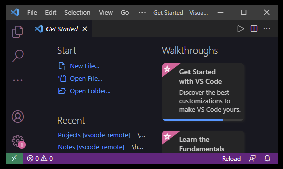

# Node and VSCode Terminal
## Terminal

### Open VSCode:
```
code .          // opens VSCode in WSL into Ubuntu
```

GUI version: 



<br>

### List files in the current directory:
```
ls              // show every file and folder in the directory
//  Flags
// ? a dash - signifies a flag. Flags come after commands.
-a
ls -a           // shows hidden files as well
```

<br>

### Change directiories
```
cd              // change dirctory eg cd C:\
cd C:/

cd ..           // go up one directory
cd ../..        // go up two directories etc.
```

<br>

### Make a new directory
```mkdir           // make a new directory in the current directory you are in
mkdir test_directory
                // make new directory test_directory in the current directory
mkdir test_directory2/nested_directory
                // make a new directory in the current directory you are in
```

<br>

### Make a new file
```
touch           // make a new file inside your current directory
touch test.js   // make new file test.js inside your current directory
```

<br>

### Show where you currently are
```
pwd             // show the current directory you are in
                // stands for "present working directory"
```

<br>

### Print out a file
```
cat             // print out a file
cat test.js     // print out the contents of test.js
```

<br>

### Remove a file or directory
**DESTRUCTIVE. BE CAREFUL. THERE AIN'T NO UNDO HERE**
```
rm              // removes a file / directory
rm test.js
rm -i           // asks for verification (proceed? y/n)
rm -r           // recursive
```
