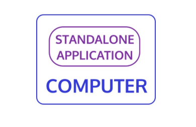
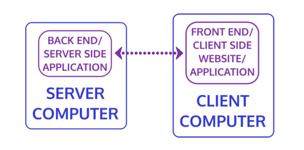

# Web Development Fundementals

## HTML vs. CSS vs. JS

### HTML
- HyperText Markup Language
- Used to give structure and meaning to and define webpage content 
    - text, images, audio, video, forms, etc
- First language of the web 
    - most basic building block of a web page

### CSS
- Cascading Style Sheets
- Create and change webpage appearance, styles & positioning 
    - fonts, colors, margins, animations, art, backgrounds, div styles, etc
- Changes apply top-down, later changes **overwrite** previous changes

### JS
- JavaScript
    - Programming language: able to make computations and transform data according to logical instructions
- Can change the HTML and CSS of a webpage and make it dynamic: change it in response to conditions in the code
- Most powerful & complex of the three core technologies

 

## Web Design vs. Web Development
### Web Design
- Graphic design, aesthetic concerns such as fonts, colors, layout
- Web designers create the design and hand off the design to a web developer to translate it into code

**Web Development is NOT Web Design**

## Web Development

### Standalone and Server Setups:
### Standalone 

In a Stand-alone program, a server is not needed. If you want to open calculator, or Solitare, it's just there on your PC. 

You can think of this like a RPG or FPS game. Aside from DLC or updates it's a self-contained product.

### Server-Supported:

To access the live version of a web site, your web browser needs to contact a web server over an internet connection. 
A web server is a computer connected to the internet and configured to respond to requests from a web client (such as a web browser) from a client computer.
The browser requests a web page from the server, and the server sends back the code the browser needs to display the web site.
    

The client and server will continue to communicate data back and forth to each other over the internet. 

 

## Front End vs. Back End vs. Full Stack
     
In server-supported web pages and applications, different "Ends" of the web page are the client-side browser and the server-side code. 

HTML, CSS, and JS are all clinet-side, Front End technologies. 
The code that lives server-side is referred to as the Back End. 

 

### Front End
- Code downloaded to & run on client-side computer 
    - CSS, HTML, JavaScript

### Back End
- Code on the server-side computer that responds to requests from the client 
    - can be JavaScript, PHP, Ruby, Python, etc

### Full Stack 
 - Both front and back end together

 

## Libraries and Frameworks
- Developers often package reuseable code as open-source libraries and frameworks
- Shared with other developers to use instead of reinventing wheel 
- Many CSS & JavaScript libraries and frameworks
- Rare to write webpages from scratch without using one or more
- After learning HTML/CSS/JavaScript, next step is to start learning popular libraries/frameworks